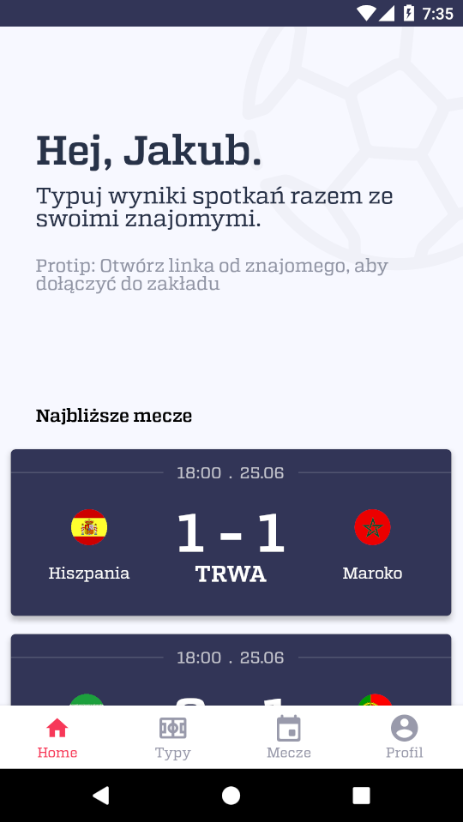
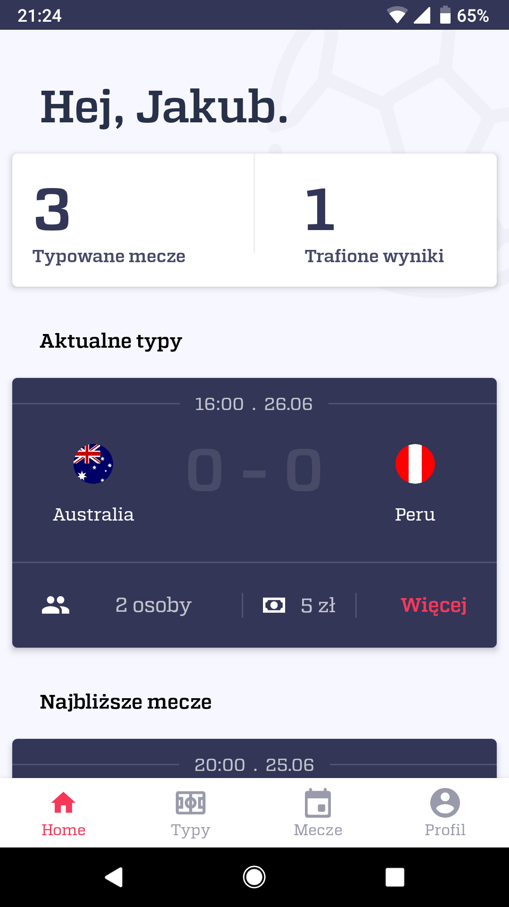
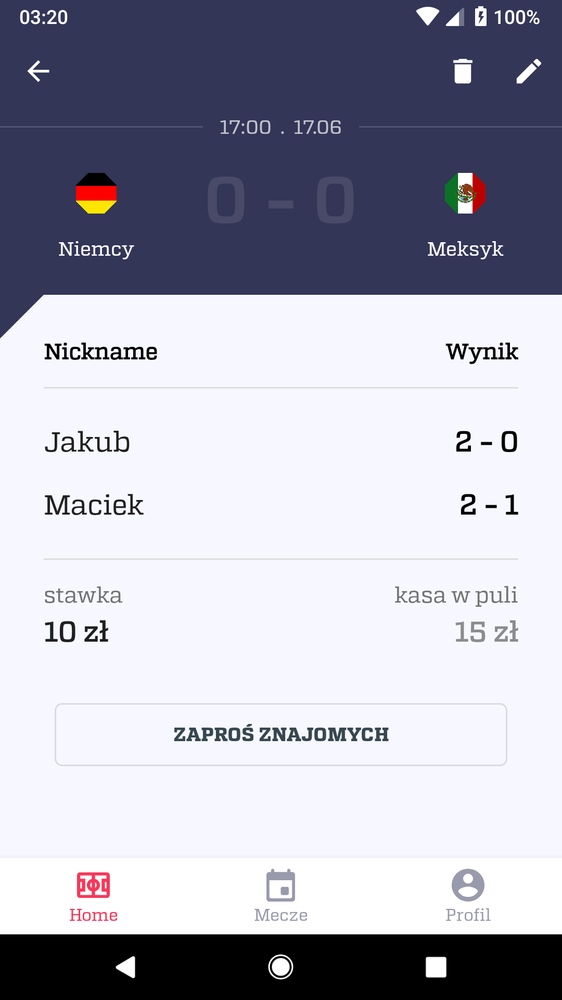
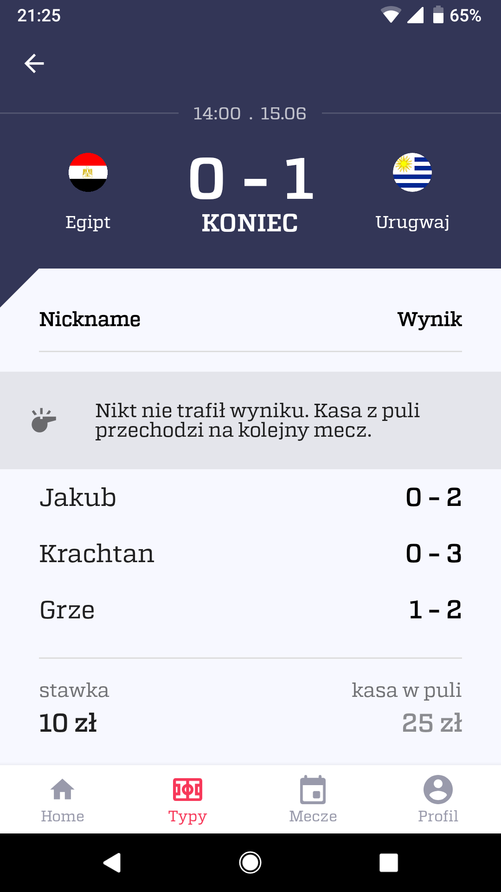

# Bet (Obstawiamy mundial)
Bet World Cup games with friends

<a href=".media/1.png"></a>
<a href=".media/2.png"></a>
<a href=".media/3.png"></a>
<a href=".media/4.png"></a>

# Description
Application written right before 2018 FIFA World Cup with intention for learning Dagger2 and MVVM.

Firebase Firestore is used as read-only database which provides realtime updates and zero impact on real backend. 
Fetching match updates, betting and push notifications is controlled by [Golang backend](https://github.com/JaCzekanski/bet-server).

Application doesn't require any authentication as it relies on Anonymous Signin feature of Firebase Auth.
Inviting friends to bets is done using Firebase Invites (now Firebase Dynamic Links) simplifying whole user experience. 

# Technologies
[Android app](https://github.com/JaCzekanski/bet-app):
- Kotlin
- Dagger
- MVVM
- RxJava
- Firebase (Auth, FCM, Invites, Remote Config)
- Retrofit2
- OkHttp
- Moshi

[Backend](https://github.com/JaCzekanski/bet-server): 
- Golang
- Firebase Admin
- Gorilla
- Gocron

# Build
```
./gradlew :app:assembleDebug
```
*Note: google-services.json file is required*

# Authors
- [Jakub Czekański](https://www.github.com/JaCzekanski) - Android and Backend development
- [Kacper Rachtan](https://www.behance.net/sober) - Idea, UI and UX